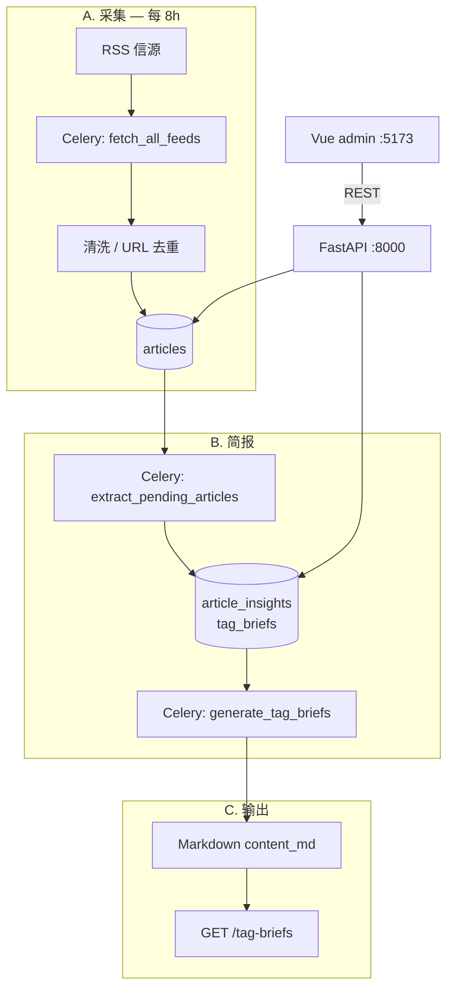

# 系统架构

> HOT — 整体技术栈、目录结构、模块间数据流。实现前必读。

---

# 技术栈总览

| 层级 | 选型 |
|------|------|
| 前端 | Vue 3 + TypeScript + Vite + Element Plus（M4 管理后台） |
| API | FastAPI (async) |
| 任务 | Celery + Celery Beat + Redis |
| 数据库 | PostgreSQL 16+ |
| LLM | **DeepSeek**（OpenAI 兼容接口）+ Instructor + Pydantic |
| 部署 | Docker Compose |

### DeepSeek 配置（运行时）

| 环境变量 | 说明 |
|----------|------|
| `DEEPSEEK_API_KEY` | 用户提供的 API Key（不入库、不提交 git） |
| `DEEPSEEK_BASE_URL` | 默认 `https://api.deepseek.com` |
| `DEEPSEEK_MODEL` | 默认 `deepseek-chat` |

### 调度默认值（已决）

| 环境变量 | 默认值 | 说明 |
|----------|--------|------|
| `FETCH_INTERVAL_MINUTES` | `480` | 每 8 小时拉取 RSS |
| `BRIEF_WINDOW_HOURS` | `8` | 简报纳入最近 8 小时内入库文章（`fetched_at`） |

---

# 逻辑架构



**数据流**

1. **采集（8h）**：Beat 触发 `fetch_all_feeds` → RSS → `articles`；任务末尾链式 `extract_pending(limit=30)`。
2. **提炼**：DeepSeek → `article_insights`；兜底 Beat 每 900s 运行 `extract_pending_articles(limit=20)`。
3. **简报**：`generate_tag_briefs` 按 tag、`fetched_at` 落在 `[now-8h, now)` 且 `status=extracted` → `tag_briefs.content_md`。
4. **输出**：REST 与 Vue 后台查看/下载 Markdown；**无 IM Webhook（M5）**。

---

# 未实现（勿在代码中假设存在）

| 能力 | 计划 |
|------|------|
| Jina Reader 全文 | M5 或更晚 |
| `reports/` 目录导出 | 未规划实现 |
| `services/delivery/`、飞书/企微 | M5 |
| GitHub Actions CI | TODO |

---

# 仓库目录结构（当前）

```
Project_Aestas/
├── backend/
│   ├── app/
│   │   ├── main.py
│   │   ├── core/
│   │   ├── api/v1/
│   │   ├── models/
│   │   ├── schemas/
│   │   ├── services/
│   │   │   ├── ingestion/
│   │   │   ├── extraction/
│   │   │   └── briefing/
│   │   └── workers/
│   ├── alembic/
│   └── tests/
├── frontend/
│   └── src/
│       ├── views/          # Dashboard, Feeds, Articles, Briefs, Prompts
│       ├── api/
│       └── router/
├── docker-compose.yml          # 项目名 aestas；postgres, redis, api, worker, beat, admin
├── memory-bank/
└── README.md
```

模块细节见 `memory-bank/domains/*.md`。

---

# 核心 Celery 任务（Beat）

配置：`backend/app/workers/celery_app.py`

| 任务 | Beat 周期 | 说明 |
|------|-----------|------|
| `worker_heartbeat` | `celery_heartbeat_interval_seconds`（默认 60s） | DB 连通冒烟 |
| `fetch_all_feeds` | `fetch_interval_minutes * 60`（默认 28800s / 8h） | 拉取活跃 RSS；内链提炼最多 30 条 |
| `extract_pending_articles` | **900s** | 兜底消化 pending |
| `generate_tag_briefs` | 同 fetch 间隔 | 各 tag 生成 Markdown 简报 |

幂等：同一 `article` 不重复提炼；同一 `(tag_id, window_start)` 仅一份 `tag_brief`。

---

# 管理后台路由

`frontend/src/router/index.ts`：

| 路径 | 页面 |
|------|------|
| `/` | 控制台 |
| `/feeds` | 信源 |
| `/articles` | 文章 |
| `/briefs` | 简报 |
| `/prompts` | Prompt 模板 |

---

# 前后端交互

- REST：`/api/v1` 管理 tag、信源、文章、简报、Prompt、手动任务。
- 简报主体为 **Markdown**（`content_md`）。
- 认证：`X-API-Key`（`API_KEY`）；`ENVIRONMENT=development` 时可省略头（见 `known-issues.md`）。

---

# 与 n8n 的关系

n8n 已验证流程；本仓库用 Celery + 代码库替代，便于测试与 8h 调度。
