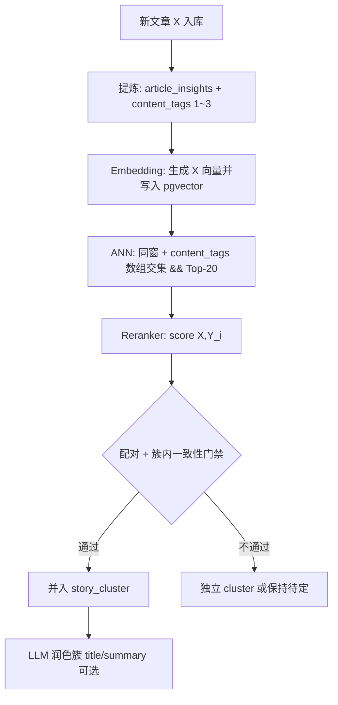

# M5b-2 规划：Embedding + pgvector ANN + 本地 Reranker

> WARM — 用户确认（2026-06-03，第二轮澄清）。实施前以本文 + `decisions.md` ADR-011/012 为准。

---

## 用户确认（2026-06-03）

| 项 | 决定 |
|----|------|
| 默认模型 | `BAAI/bge-m3` + `BAAI/bge-reranker-v2-m3`，后续再换 |
| 配对阈值 | `RERANK_PAIR_THRESHOLD=0.85` 默认，上线后样本标定 |
| LLM 聚类 | **保留** `CLUSTERING_MODE=llm` 可选 |
| 簇标题 | 允许 LLM 润色（`purpose=cluster_title`，后台可编辑） |

---

## 修正后的主流程（隐患 3 修补）

**新文章 X 必须先完成提炼与向量化，才能做 ANN。**



**硬性顺序**：`extract → embed → ann → rerank → assign`（不可跳过 embed）。

---

## 双层 Tag 体系（隐患 2 + 多标签四点）

### 为什么需要两层

| 层 | 字段 | 来源 | 用途 |
|----|------|------|------|
| **信源路由 Tag** | `articles.tag_id` | RSS 信源绑定（军事/科技/汽车） | 信源管理、简报分板块、运营视图 |
| **内容 Taxonomy Tag** | `article_insights.content_tags` | 提炼时 LLM 从预定义池选 **1~3 个** | **缩小 ANN 检索空间**；跨信源召回 |

**聚类 ANN 不用 `articles.tag_id` 完全相等**，而用 `content_tags && 候选.tags`（数组交集）。

同源报道常被不同媒体归入不同信源板块；仅按 `tag_id` 过滤会 **False Negative**。内容多标签 + 交集召回解决此问题。

### 关键点一：多标签，禁止单选

- 每篇 `content_tags`：**1~3 个** slug，来自预定义池
- Instructor/Pydantic 校验：非法 slug 拒绝或回落到 `society_other`

### 关键点二：提炼 Prompt + Structured Output

在现有 `ArticleInsightStructured` 上扩展 `content_tags: list[str]`（`min_length=1`, `max_length=3`）。

System 约束示例（seed 写入 `prompt_templates`）：

```
从【预定义标签池】挑选 1~3 个最符合新闻内容的标签（可多选，禁止只选一个敷衍）。
【预定义标签池】：{taxonomy_list}
```

标签池通过代码/DB 注入 Prompt，保证 LLM 不瞎编。

### 关键点三：颗粒度 15~30 个大类

**不用**几百细分类。目的仅是砍掉 90% 明显不相关检索空间（体育 vs 军事），细粒度交给 Embedding + Reranker。

**种子 Taxonomy（20 项，slug → 中文名）** — 实施时 `seed-taxonomy` 落库：

| slug | 中文 |
|------|------|
| `politics` | 政治 |
| `economy` | 经济财经 |
| `technology` | 科技 |
| `military_conflict` | 军事与冲突 |
| `disaster` | 灾害事故 |
| `sports` | 体育 |
| `entertainment` | 文娱 |
| `crime_law` | 法治犯罪 |
| `health_science` | 健康科学 |
| `society` | 社会民生 |
| `energy` | 能源 |
| `automotive` | 汽车交通 |
| `real_estate` | 房地产 |
| `trade` | 贸易 |
| `diplomacy` | 外交 |
| `environment` | 环境气候 |
| `education` | 教育 |
| `labor` | 劳动就业 |
| `cyber` | 网络信息安全 |
| `other` | 其他 |

信源 Tag 与 Taxonomy **映射**（`tags.taxonomy_slugs text[]`，可选辅助简报，**不用于 ANN 硬过滤**）：

- 军事 → `[military_conflict, politics, diplomacy]`
- 科技 → `[technology, cyber, economy]`
- 汽车 → `[automotive, technology, economy]`

### 关键点四：pgvector 查询用数组交集

```sql
-- X 的 content_tags = ARRAY['technology','politics']
WHERE i.content_tags && :x_tags          -- 有交集即可，非完全相等
  AND a.fetched_at >= :ws AND a.fetched_at < :we
  AND a.status = 'extracted'
  AND a.id != :self_id
  AND i.embedding IS NOT NULL
ORDER BY i.embedding <=> :query_vec
LIMIT 20;
```

`content_tags` 上建 **GIN 索引**（`gin__content_tags`）。

---

## 防链式漂移（隐患 1）

### 问题

纯 **Union-Find** 会因传递性把语义已漂移的文章并在一起（A≈B, B≈C ⇒ A 与 C 同簇，但 A↔C 可能很低）。

### 决策：**不用全图 Union-Find**，改用 **增量归属 + 簇内一致性门禁**

窗内按 `fetched_at` **升序**处理（模拟真实增量）：

1. X 已完成 `extract → embed`
2. ANN Top-20（`content_tags &&` + 同窗）
3. Reranker 得 `score(X, Y_i)`
4. 对每个 **已有 cluster C**（通过某成员 Y 代表）：
   - `pair_score = score(X, Y)`（取 C 内与 X 得分最高的成员）
   - `avg_score = mean(score(X, m))` for all m ∈ C
   - **并入条件**（同时满足）：
     - `pair_score >= RERANK_PAIR_THRESHOLD`（默认 **0.85**）
     - `avg_score >= RERANK_CLUSTER_AVG_MIN`（默认 **0.80**）
5. 若有多个 C 满足，选 `avg_score` 最高者；若无，X **单独成簇**
6. **禁止**仅因 A–B、B–C 高就把 A、C 并簇（除非 A 对 C 所在簇也通过 4 的门禁）

**标定建议**：若仍见漂移，优先将 `RERANK_PAIR_THRESHOLD` 提到 **0.90**（宁可少并），而非放宽 `avg` 门禁。

**备选（M5b-2c+）**：Louvain 社区发现作离线全窗重聚类；v1 不默认。

### 两文新簇

若 X、Y 均未归属且 `score(X,Y) >= pair_threshold`，可建 **2 文小簇**（不再向外传递合并除非新成员通过簇内 avg 门禁）。

---

## 存储与索引

### 迁移 `005_taxonomy_content_tags`（可与 pgvector 合并为 `005_m5b2`）

```sql
CREATE TABLE taxonomy_tags (
  slug varchar(32) PRIMARY KEY,
  name_zh varchar(64) NOT NULL,
  sort_order int NOT NULL DEFAULT 0
);

ALTER TABLE tags ADD COLUMN taxonomy_slugs text[] DEFAULT '{}';

ALTER TABLE article_insights
  ADD COLUMN content_tags text[] NOT NULL DEFAULT '{}';

CREATE INDEX ix_article_insights_content_tags_gin
  ON article_insights USING gin (content_tags);
```

### 迁移 `006_pgvector_embeddings`

```sql
CREATE EXTENSION IF NOT EXISTS vector;

ALTER TABLE article_insights
  ADD COLUMN embedding vector(1024),
  ADD COLUMN embedding_model varchar(64),
  ADD COLUMN embedded_at timestamptz;

CREATE INDEX ix_article_insights_embedding_hnsw
  ON article_insights USING hnsw (embedding vector_cosine_ops);
```

### Docker

- `postgres:16-alpine` → `pgvector/pgvector:pg16`
- Worker volume：`./data/models:/models`

---

## 聚类模式

| `CLUSTERING_MODE` | 行为 |
|-------------------|------|
| `vector`（**默认**） | embed → ANN → Reranker → 增量归属 + 门禁 |
| `llm` | 现有 M5b-1 批量分组（控制台可切换） |

**簇元数据**：

1. 默认取 primary 成员 `structured.headline/summary`
2. **LLM 润色**：`purpose=cluster_title`，输入簇内各源标题摘要，输出中文事件标题+摘要（Prompt 后台可编辑）

---

## 简报与 cluster 归属

聚类改为 **同窗全局**（按 content_tags 交集召回），不再按 `articles.tag_id` 切窗聚类。

**简报纳入规则**（生成 tag T 的简报时）：

- 纳入 cluster C，若 ∃ 成员文章满足：
  - `article.tag_id = T`，**或**
  - `insight.content_tags && tags.taxonomy_slugs`（T 的映射与内容标签有交集）

同一跨板块事件可出现在多份简报中（符合多源编辑场景）。

`story_clusters.tag_id` 保留为 **主归属**（primary 文章的 `articles.tag_id`），用于列表默认筛选，**不作为 ANN 硬条件**。

---

## 代码结构（计划）

```
backend/app/services/
  taxonomy/seed.py           # 20 类种子 + tags 映射
  extraction/schemas.py      # + content_tags
  clustering/
    embedding.py
    ann_search.py            # && content_tags + 同窗
    reranker.py
    incremental_cluster.py   # 增量归属 + 簇内 avg 门禁（非 Union-Find）
    llm_grouping.py          # 保留
    cluster_title.py         # LLM 润色
    service.py               # MODE 分发
```

**任务**：

| 任务 | 说明 |
|------|------|
| `embed-pending` | 补向量 |
| `seed-taxonomy` | 标签池 + 信源映射 |
| `cluster-briefs` | 默认 vector；body 可 `mode=llm` |

---

## 实施分期

| 子阶段 | 交付 |
|--------|------|
| **M5b-2a** | pgvector、taxonomy、`content_tags` 提炼字段、extract 后 embed |
| **M5b-2b** | ANN `&&` + Reranker + 增量门禁聚类 + LLM 簇标题润色 |
| **M5b-2c** | 阈值标定工具、配对/avg 得分日志、`CLUSTERING_MODE` 控制台切换 |

---

## 测试策略

- `content_tags`：Pydantic 校验 1~3、非法 slug
- ANN SQL：`&&` 交集召回（Tech+Politics 命中 Tech+Economy）
- 防漂移：构造 A–B、B–C 高但 A 对 C 簇 avg 低 → **不并入**
- 流程：未 embed 的文章不进入 ANN

---

## 配置项（环境变量）

| 变量 | 默认 |
|------|------|
| `EMBEDDING_MODEL` | `BAAI/bge-m3` |
| `RERANKER_MODEL` | `BAAI/bge-reranker-v2-m3` |
| `ANN_TOP_K` | `20` |
| `RERANK_PAIR_THRESHOLD` | `0.85` |
| `RERANK_CLUSTER_AVG_MIN` | `0.80` |
| `CLUSTERING_MODE` | `vector` |

---
