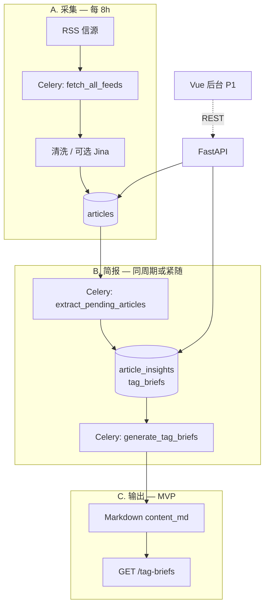

# 系统架构

> 🔥 HOT — 整体技术栈、目录结构、模块间数据流。实现前必读。

---

# 技术栈总览

| 层级 | 选型 |
|------|------|
| 前端 | Vue 3 + TypeScript + Vite + Element Plus（P1） |
| API | FastAPI (async) |
| 任务 | Celery + Celery Beat + Redis |
| 数据库 | PostgreSQL 16+ |
| LLM | **DeepSeek**（OpenAI 兼容接口）+ Instructor + Pydantic |
| 全文 | Jina Reader（可选） |
| 部署 | Docker Compose |

### DeepSeek 配置（运行时）

| 环境变量 | 说明 |
|----------|------|
| `DEEPSEEK_API_KEY` | 用户提供的 API Key（不入库、不提交 git） |
| `DEEPSEEK_BASE_URL` | 默认 `https://api.deepseek.com` |
| `DEEPSEEK_MODEL` | 默认 `deepseek-chat` |

### 调度默认值（已决）

| 环境变量 | 默认值 | 说明 |
|----------|--------|------|
| `FETCH_INTERVAL_MINUTES` | `480` | 每 8 小时拉取 RSS |
| `BRIEF_WINDOW_HOURS` | `8` | 简报纳入最近 8 小时内的文章 |

---

# 逻辑架构



**数据流**

1. **采集（8h）**：Beat 触发 `fetch_all_feeds` → RSS → `articles`（`tag_id`、UTC 时间戳）。
2. **提炼**：`extract_pending_articles` 调用 **DeepSeek** → `article_insights`。
3. **简报**：`generate_tag_briefs` 取各 tag 在 `[now - 8h, now]` 内已提炼文章 → 写入 `tag_briefs.content_md`。
4. **输出**：编辑或你通过 API 读取 Markdown；**无 Webhook（P2）**。

---

# 仓库目录结构（规划）

```
Project_Aestas/
├── backend/
│   ├── app/
│   │   ├── main.py
│   │   ├── core/           # config（含 DeepSeek、调度常量）
│   │   ├── api/v1/
│   │   ├── models/
│   │   ├── schemas/
│   │   ├── services/
│   │   │   ├── ingestion/
│   │   │   ├── extraction/   # DeepSeek + Instructor
│   │   │   └── briefing/
│   │   └── workers/
│   ├── alembic/
│   └── tests/
├── frontend/               # P1
├── deploy/docker-compose.yml
├── reports/                # 可选：导出 Markdown 文件
├── memory_bank/
└── README.md
```

---

# 核心 Celery 任务

| 任务 | Beat 周期 | 说明 |
|------|-----------|------|
| `fetch_all_feeds` | **每 480 分钟** | 拉取所有活跃 RSS |
| `extract_pending_articles` | 抓取后链式或每 8h | DeepSeek 单条提炼 |
| `generate_tag_briefs` | 提炼后链式或每 8h | 按 tag 写 Markdown 简报 |

幂等：同一 `article` 不重复提炼；同一 `(tag_id, window_start)` 仅一份 `tag_brief`。

---

# 前后端交互

- **MVP**：REST 管理信源/文章/简报；简报主体为 **Markdown 字符串**（`content_md`）。
- **P1**：Vue 后台预览与手动触发。
- **P2**：`delivery` 服务 + `delivery_targets` 表。

认证：MVP 使用 `X-API-Key`（环境变量）。

---

# 与 n8n 的关系

n8n 已验证流程；本仓库用 Celery + 代码库替代，便于测试与 8h 调度。

---
